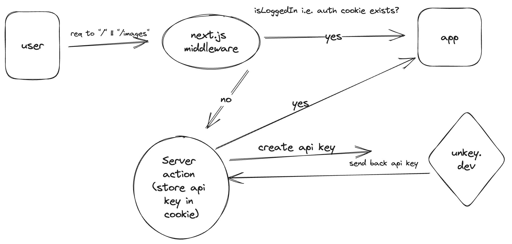

# Klu AI App

A Demo AI playground application. Built with:

- OpenAI
- Next.js 13 (App Router, Server Actions, Edge Functions)
- Vercel AI SDK
- Shadcn/ui
- Tailwind
- T3 Env
- Unkey.dev
- Zustand

## Getting Started

Copy the environment variables via:

```bash
cp .env.example .env.local
```

- Go to [unkey.dev](https://unkey.dev/app) and create a new API.
- Copy your workspace token and `apiId` to `.env.local`
- Go to the [OpenAI dashboard ](https://platform.openai.com) and create a new token and copy to `.env.local`

## Install Dependencies

Install dependencies via:

```bash
npm install
# or
yarn install
# or
pnpm install
```

## Architecture

The architecture is as follows:



## Design Decisions

- Limited Keys: I opted to use Limited keys from [Unkey](https://unkey.dev) because AI apps offer "Credits" and I believe Klu should key into this. After 3 requests, it acts as some sort of middleware and on subsequent requests the user is responded to with a 401.
- UX: I believed UX should be at the forefront of the app, so I opted for tiny embellishments i.e. tooltips, popovers etc to help create a more organic flow. I also did not want to crowd the UI. An example of this thinking was the ability to copy code snippets, instead of rendering on the page, there's a blatant button that triggers a modal, this modal then gives user free rein to copy in available languages whilst everything is not cramped. 
- Code Snippets: I opted for code snippets as close to the playground as possible, with real-time syncing for fine-tuning of variables because I deeply believe a user should be able to modfiy at will and copy and paste without needing to go to documentation or somewhere else. Like you said,"People spend a lot of time experimenting with prompts", it only makes sense that they do not lose ANY context. 
- Edge functions: I opted to use Edge functions as they are fast and deployed close to your users. I think this makes app faster. A consideration is regional edge versus global edge. Were there to be a DB I would firmly believe the edge function should live right next to the user. 
